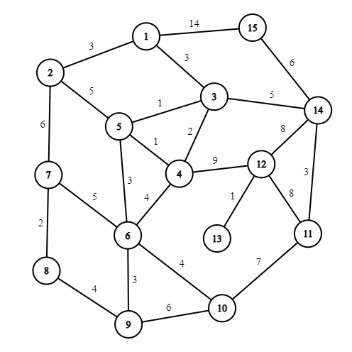
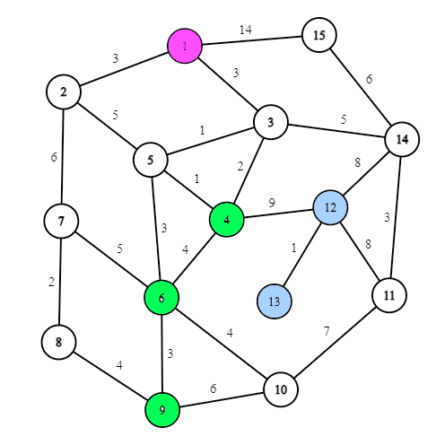
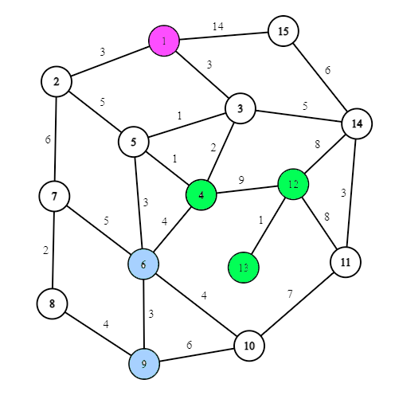

# Optimal-Delivery-System-Console

```
Class - Shortest_path_finder
```

Variables :

-   vector\<vector\> all_pair_shortest_distance; //this 2d array stores floyd warshall mini distance btw two vertices
-   vector\<vector\> all_pair_shortest_distance_intermediate_vertex; //stores the final intermediate vertices btw every pair

Functions :

-   Shortest_path_finder(map\<int,vector\<pair\<int,int\>\>\> \&graph) //constructor that takes adjacency list of graph to perform Floyd Warshall
-   Shortest_path_finder() //empty Constructor for object overloading
-   vector\<vector\> adj_list_to_matrix(map\<int,vector\<pair\<int,int\>\>\> \&graph) //this function just convertes adj_list to adj matrix to apply floyd warshall
-   vector\<vector\> adj_list_to_matrix(map\<int,vector\<pair\<int,int\>\>\> \&graph) //this function just convertes adj_list to adj matrix to apply floyd warshall
-   void Floyd_Warshall(map\<int,vector\<pair\<int,int\>\>\> \&graph) //this function applies floyd warshall on the converted matrix
-   vector calc_path(int v1,int v2) //returns the shorted path between two vertices as a vector
-   vector get_path(int v1,int v2) //this function returns optimal path between two vertices
-   vector\<vector\> get_traversal_path(vector\<vector\> \&traversal_order,int src) //this function takes the cluster and converts in to a path in that order using floyd warshall

```
Class - Brute_all_paths
```

Variables –

-   vector\<vector\> mini_time_traversal; //this 2d vector stores the cluster obtained to get mini time
-   vector\<vector\> mini_distance_traversal; //this 2d vector stores the cluster obtained to get mini distance
-   vector\<vector\> mini_cost_traversal; //this 2d vector stores the cluster obtained to get mini cost
-   set\<pair\<set\<vector\>,vector\>\> Global_Memoize; //this set of pair of (vector,vector) is used to memoize the brute to obtain all paths
-   int no_of_Drivers; // stores no of drivers
-   int mini_cost=INT_MAX; // stores minimum cost
-   int mini_time=INT_MAX; //stores minimum time
-   int mini_distance=INT_MAX; //stores minimum distance
-   vector\<vector\> path; //stores the currently obtained path in brute
-   int penalty=100; //stores the currently set penalty
-   vector delivery_deadline; //stores the delivery deadlines as a hash (index-\> vertex no and value is the deadline for that index )
-   vector\<vector\> floyd_Warshall_cost; //2d vector obtained from shortest path finder class
-   struct path_desc //structure that contains the description of the currently bruted path

Functions :

-   void Print_cluster(vector\<vector\> \&cluster) //just a cluster printer function
-   path_desc calc_path_desc(int src) //calculates mini distance , time and cost of the currently bruted path
-   void cal_all_paths(vector \&delivery_locations,int index,int no_of_drivers,int src) //recursive function that brutes all possible paths
-   void print_path_traversed_by_drivers(vector\<vector\> \&traversal_order,int src,Shortest_path_finder \&g1) //takes the cluster and prints the path followed by each driver
-   void display(Shortest_path_finder \&g1,int src) //display details of the best possible path
-   Brute_all_paths(vector\<vector\> \&floyd_Warshall_costs,int src,vector \&delivery_locations,int no_of_drivers,vector \&delivery_deadlines) //constructor that calls all permutations of delivery location to be bruted

```
Class - Greedy Cluster
```

Variables –

-   Shortest_path_finder g1; // to store a copy of already computed object of Shortest_path_finder class
-   int src; //stores the source vertex
-   vector delivery_locations; //delivery locations
-   int no_of_drivers; //stores no of drivers
-   vector delivery_deadlines; //stores the delivery deadlines as a hash (index-\> vertex no and value is the deadline for that index )
-   vector cluster_initializers; //stores the initial cluster initilizers
-   vector\<vector\> clusters; //stores the final cluster obtained through greedy
-   vector rem_delivery_locations; //store the delivery locations remaining after removing the initial cluster initialisers
-   int penalty = 100; //stores the penalty for delay
-   struct path_desc //structure that contains the description of the current path

Functions –

-   void calc_path_desc() //calculates mini distance , time and cost
-   Greedy_Cluster(Shortest_path_finder \&g,int source,vector \&Delivery_locations,int No_of_drivers,vector \&Delivery_deadlines) //constructor that initializes all the variables
-   void calc_cluster_initilizers() //this function finds the initial two cluster initializers
-   void find_rem_cluster_sources() //this function finds remaining cluster initializers
-   void populate_clusters() //this function assigns a cluster to all remaining delivery locations
-   void display_clusters() //just a cluster printer function
-   void job_scheduling_on_clusters() //sorts the clusters on the basis of their deadline
-   void Display_cluster_path_traversed() //prints the path from the cluster

# 

```
Input Format –  
```

# 

no of vertex , no_of_edge , src , no_of_drivers

v11 v12 w1

v21 v22 w2

.

.

vno_of_edge1 vno_of_edge2 wno_of_edge

no_of_delivery_locations

d1 t1 // delivery vertex , deadline

d2 t2

d3 t3

.

.

d (no_of_delivery_locations) , t(no_of_delivery_locations)

```
Testcase 1 – 
```

15 24 1 4

1 2 3

1 3 3

3 4 2

3 5 1

4 5 1

5 6 3

5 2 5

6 7 5

6 4 4

7 8 2

7 2 6

8 9 4

9 10 6

9 6 3

10 11 7

10 6 4

11 12 8

12 13 1

12 4 9

12 14 8

14 11 3

14 3 5

14 15 6

15 1 14

5

4 4

6 8

9 10

12 16

13 15



```
For Optimal Time – 
```



Minimum time possible - 15

Mini time Cluster -

[ 4 6 9 ]

[ 12 13 ]

[ ]

[ ]

Mini time path traversed -

path Traversed by Driver 1 -\> 1 3 4 6 9

path Traversed by Driver 2 -\> 1 3 4 12 13

path Traversed by Driver 3 -\>

path Traversed by Driver 4 -\>

```
For Optimal Distance – 
```


Minimum distance possible - 25

Mini Distance Cluster -

[ 4 12 13 ]

[ 6 9 ]

[ ]

[ ]

Mini distance traversal -

path Traversed by Driver 1 -\> 1 3 4 12 13

path Traversed by Driver 2 -\> 1 3 5 6 9

path Traversed by Driver 3 -\>

path Traversed by Driver 4 -\>

```
For Optimal Cost – 
```



Minimum cost possible - 125

Mini Cost Cluster -
[ 4 12 13 ]
[ 6 9 ]
[ ]
[ ]

Mini Cost traversal -

 path Traversed by Driver 1 -> 1 3 4 12 13

 path Traversed by Driver 2 -> 1 3 5 6 9

 path Traversed by Driver 3 ->

 path Traversed by Driver 4 ->
